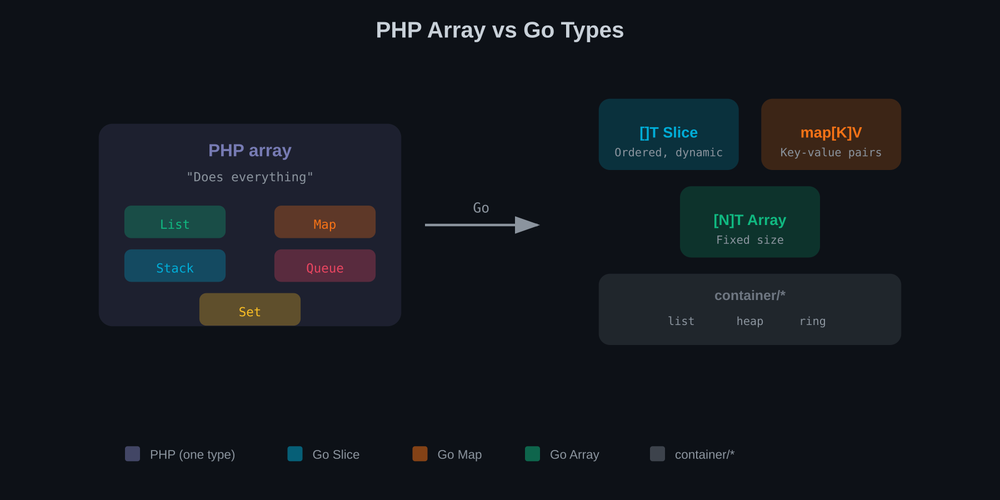
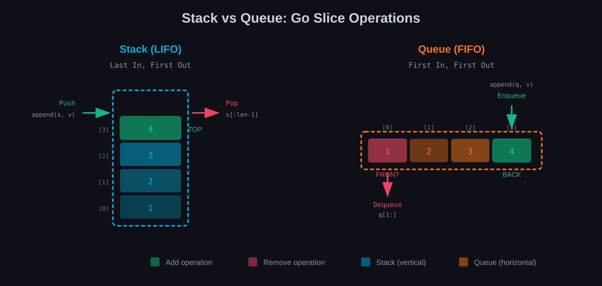
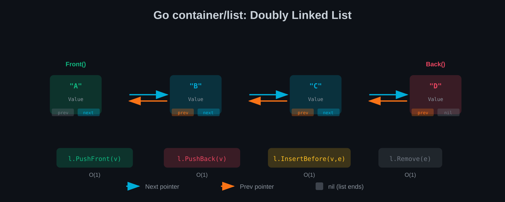
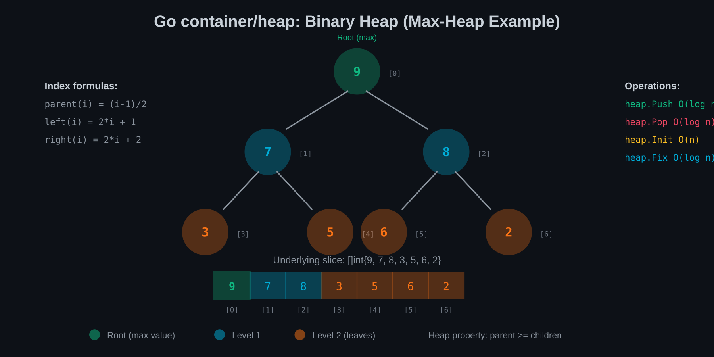
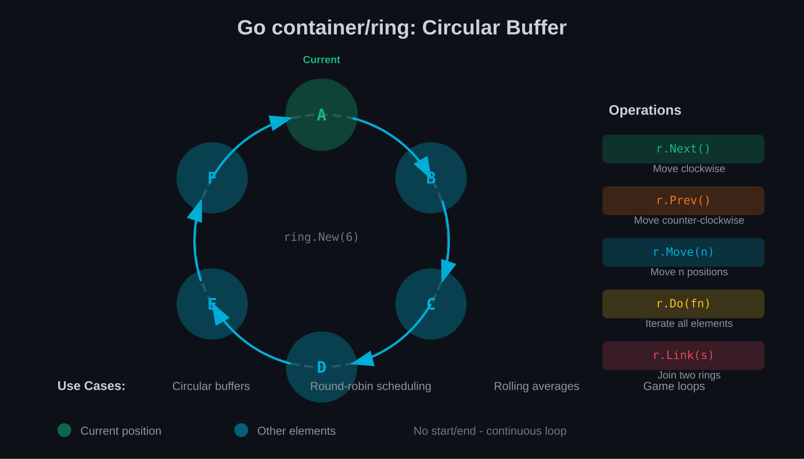

# Chapter 3: The Type System Transition

PHP's relationship with types has evolved dramatically. From PHP 4's complete absence of type hints, through PHP 7's scalar types, to PHP 8's union types and intersection types—the language has gradually embraced static typing while preserving dynamic flexibility.

Go, by contrast, was statically typed from day one. Every value has exactly one type, known at compile time, no exceptions.

This chapter explores how to transition your mental model from PHP's flexible typing to Go's strict typing.

## From `$anything` to Strict Types

In PHP, variables are vessels that can hold anything:

```php
$value = 42;
$value = "forty-two";
$value = ['forty', 'two'];
$value = new FortyTwo();

function process($input) {
    // $input could be anything
    // Your code must handle all possibilities
}
```

Even with modern PHP's type declarations, dynamic typing remains the default:

```php
declare(strict_types=1);

function processString(string $input): string
{
    return strtoupper($input);
}

// Without strict_types, this might work via coercion
// With strict_types, it fails at runtime
processString(42);
```

Note the key word: **runtime**. PHP discovers type errors when the code executes.

### Go's Compile-Time Certainty

In Go, every variable has exactly one type, forever:

```go
var value int = 42
value = "forty-two"  // Compile error: cannot use string as int

func process(input string) string {
    // input is always a string, guaranteed
    return strings.ToUpper(input)
}

process(42)  // Compile error: cannot use int as string
```

The Go compiler rejects invalid code before it ever runs. There's no `strict_types` to enable—strictness is the only mode.

### What You're Giving Up

PHP's dynamic typing enables powerful patterns:

```php
// Generic containers
$cache = [
    'user:1' => $userObject,
    'config' => ['debug' => true],
    'counter' => 42,
];

// Flexible function parameters
function dump(...$values): void
{
    foreach ($values as $value) {
        var_dump($value);  // Works with anything
    }
}

// Duck typing
function getLength($item): int
{
    return count($item);  // Works with arrays, Countable, etc.
}
```

Go requires explicit type definitions for each case:

```go
// Separate caches for different types
userCache := make(map[string]User)
configCache := make(map[string]map[string]bool)
counterCache := make(map[string]int)

// Or use interface{}/any (loses type safety)
cache := make(map[string]any)
cache["user:1"] = userObject
cache["config"] = map[string]bool{"debug": true}
cache["counter"] = 42
// But now you need type assertions to use values
```

This is the fundamental trade-off: flexibility versus safety.

## Type Inference: Go's Compromise

Go's designers understood that explicit typing everywhere is tedious. Their solution: **type inference** with the short declaration operator `:=`.

```go
// Explicit type
var name string = "Alice"
var age int = 30

// Inferred type (same result)
name := "Alice"  // inferred as string
age := 30        // inferred as int

// Works with complex types
users := []User{{Name: "Alice"}, {Name: "Bob"}}  // inferred as []User
config := map[string]int{"port": 8080}           // inferred as map[string]int
```

The type is still static and known at compile time—the compiler infers it from the right-hand side. This gives you PHP-like brevity with Go's compile-time safety.

### Where Inference Stops

Type inference has limits:

```go
// The compiler can't infer the type of an empty literal
var users []User        // Must specify type
users := []User{}       // Or use typed literal

// Function signatures are never inferred
func add(a int, b int) int {  // Must specify all types
    return a + b
}

// Interface variables need explicit types when empty
var reader io.Reader  // Must declare interface type
```

The pattern: Go infers types from values but requires explicit types for declarations without values.

## When You Miss `mixed` and When You Don't

PHP 8 introduced the `mixed` type to explicitly indicate "any type":

```php
function log(mixed $message): void
{
    file_put_contents('log.txt', print_r($message, true), FILE_APPEND);
}
```

Go's equivalent is `any` (alias for `interface{}`):

```go
func log(message any) {
    file, _ := os.OpenFile("log.txt", os.O_APPEND|os.O_WRONLY, 0644)
    defer file.Close()
    fmt.Fprintln(file, message)
}
```

Both work, but there's a crucial difference in how you use the value:

```php
// PHP: Use it directly
function processValue(mixed $value): string
{
    if (is_array($value)) {
        return implode(', ', $value);
    }
    return (string) $value;
}
```

```go
// Go: Must type-assert first
func processValue(value any) string {
    switch v := value.(type) {
    case []string:
        return strings.Join(v, ", ")
    case string:
        return v
    case fmt.Stringer:
        return v.String()
    default:
        return fmt.Sprint(value)
    }
}
```

In Go, `any` values are opaque until you assert their type. This is intentionally awkward—it discourages overuse of `any`.

### When You Actually Miss `mixed`

Legitimate uses of `any` in Go are rare:

1. **Serialisation**: `json.Unmarshal` into `map[string]any`
2. **Logging**: Print statements that accept anything
3. **Generic containers** (before Go 1.18 generics)

Most other uses signal design problems. If you reach for `any` often, you're probably fighting Go's type system instead of working with it.

## Generics: Go's Late Arrival vs PHP 8's Union Types

PHP 8's union and intersection types provide flexibility:

```php
function processId(int|string $id): User
{
    return $this->repo->find($id);
}

function setLogger(LoggerInterface&Countable $logger): void
{
    // $logger implements both interfaces
}
```

Go 1.18 introduced generics, which solve a different problem:

```go
// Generic function: works with any ordered type
func Min[T constraints.Ordered](a, b T) T {
    if a < b {
        return a
    }
    return b
}

// Usage
minInt := Min(3, 5)       // T inferred as int
minStr := Min("a", "b")   // T inferred as string
```

### Key Differences

**PHP union types** let a parameter accept multiple unrelated types. The function handles each type differently:

```php
function format(int|float|string $value): string
{
    if (is_string($value)) return $value;
    return number_format($value, 2);
}
```

**Go generics** constrain a type parameter to satisfy requirements, then treat all valid types uniformly:

```go
// T must be ordered (comparable with <)
func Sort[T constraints.Ordered](slice []T) {
    // Sorting logic that works identically for all ordered types
}
```

Go doesn't have union types. If you need `int | string`, you use:

1. **Separate functions**: `ProcessInt`, `ProcessString`
2. **Interface**: Define a common interface both types satisfy
3. **`any` with type switch**: As a last resort

```go
// Approach 1: Separate functions (clearest)
func ProcessInt(id int) User { ... }
func ProcessString(id string) User { ... }

// Approach 2: Interface (when behaviour is shared)
type Identifier interface {
    String() string
}

func Process(id Identifier) User { ... }
```

## Generics Deep Dive

Before Go 1.18, writing reusable code often meant using `interface{}` and losing type safety:

```go
// Pre-generics: lose type safety
func Contains(slice []interface{}, item interface{}) bool {
    for _, v := range slice {
        if v == item {
            return true
        }
    }
    return false
}

// Usage requires type assertions everywhere
nums := []interface{}{1, 2, 3}
found := Contains(nums, 2)
```

### Type Parameters

Generics use square brackets to declare type parameters:

```go
// T is a type parameter
func Contains[T comparable](slice []T, item T) bool {
    for _, v := range slice {
        if v == item {
            return true
        }
    }
    return false
}

// Usage: type-safe, no assertions needed
nums := []int{1, 2, 3}
found := Contains(nums, 2)  // T inferred as int

names := []string{"alice", "bob"}
found := Contains(names, "alice")  // T inferred as string
```

### Type Constraints

Constraints specify what operations a type parameter must support:

```go
import "golang.org/x/exp/constraints"

// Built-in constraint: comparable (supports == and !=)
func IndexOf[T comparable](slice []T, item T) int {
    for i, v := range slice {
        if v == item {
            return i
        }
    }
    return -1
}

// Ordered constraint: supports < > <= >=
func Max[T constraints.Ordered](a, b T) T {
    if a > b {
        return a
    }
    return b
}

// Custom constraint: define your own
type Number interface {
    ~int | ~int32 | ~int64 | ~float32 | ~float64
}

func Sum[T Number](numbers []T) T {
    var total T
    for _, n := range numbers {
        total += n
    }
    return total
}
```

The `~` prefix means "underlying type", allowing custom types:

```go
type Score int

scores := []Score{10, 20, 30}
total := Sum(scores)  // Works because Score's underlying type is int
```

### Generic Types

Generics work with types, not just functions:

```go
// Generic stack
type Stack[T any] struct {
    items []T
}

func (s *Stack[T]) Push(item T) {
    s.items = append(s.items, item)
}

func (s *Stack[T]) Pop() (T, bool) {
    if len(s.items) == 0 {
        var zero T
        return zero, false
    }
    item := s.items[len(s.items)-1]
    s.items = s.items[:len(s.items)-1]
    return item, true
}

func (s *Stack[T]) Peek() (T, bool) {
    if len(s.items) == 0 {
        var zero T
        return zero, false
    }
    return s.items[len(s.items)-1], true
}

// Usage
intStack := Stack[int]{}
intStack.Push(1)
intStack.Push(2)
val, _ := intStack.Pop()  // val is int, no assertion needed

stringStack := Stack[string]{}
stringStack.Push("hello")
```

### Generic Maps and Utility Functions

```go
// Map: apply function to each element
func Map[T, R any](slice []T, fn func(T) R) []R {
    result := make([]R, len(slice))
    for i, v := range slice {
        result[i] = fn(v)
    }
    return result
}

// Filter: keep elements matching predicate
func Filter[T any](slice []T, fn func(T) bool) []T {
    var result []T
    for _, v := range slice {
        if fn(v) {
            result = append(result, v)
        }
    }
    return result
}

// Reduce: fold slice to single value
func Reduce[T, R any](slice []T, initial R, fn func(R, T) R) R {
    result := initial
    for _, v := range slice {
        result = fn(result, v)
    }
    return result
}

// Usage
nums := []int{1, 2, 3, 4, 5}

doubled := Map(nums, func(n int) int { return n * 2 })
// [2, 4, 6, 8, 10]

evens := Filter(nums, func(n int) bool { return n%2 == 0 })
// [2, 4]

sum := Reduce(nums, 0, func(acc, n int) int { return acc + n })
// 15
```

### Generics Best Practices

**1. Use descriptive type parameter names for clarity:**

```go
// Less clear
func Process[T, U any](input T) U { ... }

// More clear
func Transform[Input, Output any](input Input) Output { ... }
```

**2. Prefer interface constraints over `any` when possible:**

```go
// Too permissive
func Sort[T any](slice []T) { ... }  // How do you compare T?

// Properly constrained
func Sort[T constraints.Ordered](slice []T) { ... }
```

**3. Don't overuse generics—concrete types are often clearer:**

```go
// Unnecessary generic
func AddOne[T ~int](n T) T { return n + 1 }

// Just use int
func AddOne(n int) int { return n + 1 }
```

**4. Use generics for data structures and algorithms, not business logic:**

```go
// Good: generic data structure
type Cache[K comparable, V any] struct { ... }

// Questionable: generic business logic
func ProcessOrder[T Order](order T) { ... }  // Just use Order interface
```

### Comparing to PHP

| Feature | PHP | Go |
|---------|-----|-----|
| Type checking | Runtime | Compile time |
| Union types | `int\|string` | Not supported (use interfaces) |
| Generic functions | No (use mixed) | Yes, with type parameters |
| Generic classes | No | Yes, generic types |
| Type inference | Limited | Full inference from usage |
| Constraints | None | Interface-based constraints |

## Type Assertions vs PHP's `instanceof`

PHP's type checking is intuitive:

```php
if ($value instanceof User) {
    echo $value->getName();
}

if (is_string($value)) {
    echo strtoupper($value);
}
```

Go uses type assertions:

```go
// Simple assertion (panics if wrong type)
user := value.(User)
fmt.Println(user.Name)

// Safe assertion (checks first)
if user, ok := value.(User); ok {
    fmt.Println(user.Name)
}

// Type switch (for multiple possibilities)
switch v := value.(type) {
case User:
    fmt.Println(v.Name)
case string:
    fmt.Println(strings.ToUpper(v))
case int:
    fmt.Println(v * 2)
default:
    fmt.Println("unknown type")
}
```

The two-value form (`value, ok := x.(T)`) is idiomatic Go—it never panics and lets you handle the "wrong type" case gracefully.

### The Empty Interface Dance

When working with `any`/`interface{}`, you'll often need multiple assertions:

```go
func extractName(data any) string {
    // Is it a map?
    if m, ok := data.(map[string]any); ok {
        // Is the "name" key a string?
        if name, ok := m["name"].(string); ok {
            return name
        }
    }
    // Is it a struct with Name field? (can't do this directly)
    // You'd need reflection or an interface
    return ""
}
```

This verbosity is intentional—it's showing you how much type information you've lost. In Go, you're better off designing types that don't require such assertions.

## Data Structures: PHP/SPL vs Go

PHP developers often use the Standard PHP Library (SPL) for data structures. Go takes a different approach: fewer built-in structures, but powerful primitives that compose well.



### PHP Arrays vs Go's Trio

PHP's array is a Swiss Army knife—ordered map, list, stack, queue, and set all in one:

```php
// PHP array does everything
$list = [1, 2, 3];                    // Indexed list
$map = ['name' => 'Alice', 'age' => 30];  // Associative array
$mixed = [0 => 'first', 'key' => 'value']; // Both!

// Dynamic operations
$list[] = 4;                          // Append
unset($list[1]);                      // Remove
$exists = isset($map['name']);        // Check key
```

Go separates these concerns into three distinct types:

```go
// Slice: dynamic, ordered list
list := []int{1, 2, 3}
list = append(list, 4)                // Append

// Map: unordered key-value pairs
m := map[string]any{"name": "Alice", "age": 30}
_, exists := m["name"]                // Check key
delete(m, "age")                      // Remove

// Array: fixed-size, value type
var arr [3]int = [3]int{1, 2, 3}      // Size is part of the type
// arr = append(arr, 4)               // Won't compile!
```

Key differences:

| Feature | PHP array | Go slice | Go map | Go array |
|---------|-----------|----------|--------|----------|
| Size | Dynamic | Dynamic | Dynamic | Fixed |
| Ordered | Yes | Yes | No | Yes |
| Key types | int/string | int only | Any comparable | int only |
| Memory | Heap | Heap (backing array) | Heap | Stack (if small) |
| Zero value | Empty array | `nil` | `nil` | Zero-filled |

### SplStack and SplQueue



PHP's SPL provides explicit stack and queue types:

```php
// PHP SplStack (LIFO)
$stack = new SplStack();
$stack->push(1);
$stack->push(2);
echo $stack->pop();  // 2

// PHP SplQueue (FIFO)
$queue = new SplQueue();
$queue->enqueue('first');
$queue->enqueue('second');
echo $queue->dequeue();  // 'first'
```

Go uses slices for both, with different access patterns:

```go
// Go stack using slice (LIFO)
stack := []int{}
stack = append(stack, 1)       // Push
stack = append(stack, 2)
top := stack[len(stack)-1]     // Peek
stack = stack[:len(stack)-1]   // Pop
fmt.Println(top)               // 2

// Go queue using slice (FIFO)
queue := []string{}
queue = append(queue, "first")  // Enqueue
queue = append(queue, "second")
front := queue[0]               // Peek
queue = queue[1:]               // Dequeue
fmt.Println(front)              // "first"
```

For type safety and encapsulation, wrap in a generic struct:

```go
type Stack[T any] struct {
    items []T
}

func (s *Stack[T]) Push(item T) {
    s.items = append(s.items, item)
}

func (s *Stack[T]) Pop() (T, bool) {
    if len(s.items) == 0 {
        var zero T
        return zero, false
    }
    item := s.items[len(s.items)-1]
    s.items = s.items[:len(s.items)-1]
    return item, true
}

func (s *Stack[T]) Len() int {
    return len(s.items)
}
```

### SplDoublyLinkedList



PHP's doubly-linked list provides O(1) insertion/removal at both ends:

```php
$list = new SplDoublyLinkedList();
$list->push('end');      // Add to end
$list->unshift('start'); // Add to start
$list->pop();            // Remove from end
$list->shift();          // Remove from start

// Iterate
foreach ($list as $item) {
    echo $item;
}
```

Go's `container/list` provides equivalent functionality:

```go
import "container/list"

l := list.New()
l.PushBack("end")        // Add to end
l.PushFront("start")     // Add to start
l.Remove(l.Back())       // Remove from end
l.Remove(l.Front())      // Remove from start

// Iterate (no generics, uses interface{})
for e := l.Front(); e != nil; e = e.Next() {
    fmt.Println(e.Value)  // Type assertion needed
}

// Type-safe wrapper
type StringList struct {
    list *list.List
}

func (sl *StringList) PushBack(s string) {
    sl.list.PushBack(s)
}

func (sl *StringList) Front() (string, bool) {
    if sl.list.Len() == 0 {
        return "", false
    }
    return sl.list.Front().Value.(string), true
}
```

When to use `container/list`:
- Frequent insertions/deletions in the middle
- Need to remove elements while iterating
- Large elements where copying is expensive

When to use slices instead:
- Random access needed
- Iteration performance matters (cache-friendly)
- Simple append/pop operations

### SplHeap and SplPriorityQueue



PHP's heap implementations require extending a class:

```php
class MaxHeap extends SplMaxHeap {
    protected function compare($a, $b): int {
        return $a - $b;
    }
}

$heap = new MaxHeap();
$heap->insert(3);
$heap->insert(1);
$heap->insert(4);
echo $heap->extract();  // 4 (maximum)

// Priority queue
$pq = new SplPriorityQueue();
$pq->insert('low', 1);
$pq->insert('high', 10);
$pq->insert('medium', 5);
echo $pq->extract();  // 'high'
```

Go's `container/heap` uses an interface-based approach:

```go
import "container/heap"

// Implement heap.Interface
type IntHeap []int

func (h IntHeap) Len() int           { return len(h) }
func (h IntHeap) Less(i, j int) bool { return h[i] > h[j] }  // Max heap
func (h IntHeap) Swap(i, j int)      { h[i], h[j] = h[j], h[i] }

func (h *IntHeap) Push(x any) {
    *h = append(*h, x.(int))
}

func (h *IntHeap) Pop() any {
    old := *h
    n := len(old)
    x := old[n-1]
    *h = old[0 : n-1]
    return x
}

// Usage
h := &IntHeap{3, 1, 4}
heap.Init(h)
heap.Push(h, 5)
fmt.Println(heap.Pop(h))  // 5 (maximum)
```

For a priority queue:

```go
type Item struct {
    value    string
    priority int
    index    int
}

type PriorityQueue []*Item

func (pq PriorityQueue) Len() int { return len(pq) }

func (pq PriorityQueue) Less(i, j int) bool {
    return pq[i].priority > pq[j].priority  // Higher priority first
}

func (pq PriorityQueue) Swap(i, j int) {
    pq[i], pq[j] = pq[j], pq[i]
    pq[i].index = i
    pq[j].index = j
}

func (pq *PriorityQueue) Push(x any) {
    n := len(*pq)
    item := x.(*Item)
    item.index = n
    *pq = append(*pq, item)
}

func (pq *PriorityQueue) Pop() any {
    old := *pq
    n := len(old)
    item := old[n-1]
    old[n-1] = nil
    item.index = -1
    *pq = old[0 : n-1]
    return item
}

// Usage
pq := make(PriorityQueue, 0)
heap.Push(&pq, &Item{value: "low", priority: 1})
heap.Push(&pq, &Item{value: "high", priority: 10})
item := heap.Pop(&pq).(*Item)
fmt.Println(item.value)  // "high"
```

### SplFixedArray

PHP's `SplFixedArray` provides a fixed-size array with better memory efficiency:

```php
$arr = new SplFixedArray(1000);
$arr[0] = 'first';
$arr[999] = 'last';
// $arr[1000] = 'error';  // RuntimeException

echo $arr->getSize();  // 1000
$arr->setSize(500);    // Resize (truncates or extends)
```

Go arrays are fixed-size by design:

```go
// Size is part of the type
var arr [1000]string
arr[0] = "first"
arr[999] = "last"
// arr[1000] = "error"  // Compile error: index out of bounds

// Array size is compile-time constant
const size = 1000
var arr2 [size]string

// Cannot resize arrays - use slices for that
slice := arr[:]       // Create slice from array
slice = append(slice, "more")  // Now can grow
```

Key difference: Go arrays are value types (copied on assignment), while PHP's `SplFixedArray` uses reference semantics:

```go
arr1 := [3]int{1, 2, 3}
arr2 := arr1        // Full copy!
arr2[0] = 999
fmt.Println(arr1[0])  // Still 1

// For reference semantics, use pointer or slice
slice1 := []int{1, 2, 3}
slice2 := slice1    // Shares backing array
slice2[0] = 999
fmt.Println(slice1[0])  // 999
```

### SplObjectStorage

PHP's `SplObjectStorage` uses objects as keys:

```php
$storage = new SplObjectStorage();

$user1 = new User('Alice');
$user2 = new User('Bob');

$storage[$user1] = 'admin';
$storage[$user2] = 'editor';

echo $storage[$user1];  // 'admin'
echo $storage->contains($user2);  // true
```

Go maps can use any comparable type as keys, including structs:

```go
type User struct {
    ID   int
    Name string
}

// Struct keys (compares all fields)
roles := make(map[User]string)
alice := User{ID: 1, Name: "Alice"}
bob := User{ID: 2, Name: "Bob"}

roles[alice] = "admin"
roles[bob] = "editor"

fmt.Println(roles[alice])  // "admin"

_, exists := roles[bob]
fmt.Println(exists)  // true
```

For pointer-based identity (like PHP's object identity):

```go
// Pointer keys (identity-based)
type User struct {
    ID   int
    Name string
}

roles := make(map[*User]string)
alice := &User{ID: 1, Name: "Alice"}
bob := &User{ID: 2, Name: "Bob"}
aliceCopy := &User{ID: 1, Name: "Alice"}  // Same values, different pointer

roles[alice] = "admin"
roles[bob] = "editor"

fmt.Println(roles[alice])      // "admin"
fmt.Println(roles[aliceCopy])  // "" (different pointer!)
```

### container/ring: Circular Buffers



Go provides `container/ring` with no PHP equivalent:

```go
import "container/ring"

// Create ring of 5 elements
r := ring.New(5)

// Fill with values
for i := 0; i < r.Len(); i++ {
    r.Value = i
    r = r.Next()
}

// Iterate (wraps around)
r.Do(func(v any) {
    fmt.Print(v, " ")  // 0 1 2 3 4
})

// Move forward/backward
r = r.Next()  // Move to next
r = r.Prev()  // Move to previous
r = r.Move(3) // Move 3 positions
```

Use cases:
- Circular buffers for streaming data
- Round-robin scheduling
- Rolling statistics (last N values)

### Sets

Neither PHP nor Go has a built-in set type. Both use maps:

```php
// PHP set using array
$set = [];
$set['apple'] = true;
$set['banana'] = true;
unset($set['apple']);
$exists = isset($set['banana']);
```

```go
// Go set using map
set := make(map[string]struct{})  // struct{} uses zero bytes
set["apple"] = struct{}{}
set["banana"] = struct{}{}
delete(set, "apple")
_, exists := set["banana"]

// Or with bool for readability
set := make(map[string]bool)
set["apple"] = true
exists := set["banana"]  // false if not present
```

Generic set implementation:

```go
type Set[T comparable] map[T]struct{}

func NewSet[T comparable]() Set[T] {
    return make(Set[T])
}

func (s Set[T]) Add(item T) {
    s[item] = struct{}{}
}

func (s Set[T]) Remove(item T) {
    delete(s, item)
}

func (s Set[T]) Contains(item T) bool {
    _, exists := s[item]
    return exists
}

func (s Set[T]) Len() int {
    return len(s)
}

// Set operations
func (s Set[T]) Union(other Set[T]) Set[T] {
    result := NewSet[T]()
    for item := range s {
        result.Add(item)
    }
    for item := range other {
        result.Add(item)
    }
    return result
}

func (s Set[T]) Intersection(other Set[T]) Set[T] {
    result := NewSet[T]()
    for item := range s {
        if other.Contains(item) {
            result.Add(item)
        }
    }
    return result
}
```

### Memory Model Differences

PHP uses reference counting with cycle detection:

```php
// PHP reference counting
$a = ['data' => str_repeat('x', 1000000)];
$b = $a;  // Copy-on-write: $a and $b share memory
$b['data'] = 'modified';  // Now separate copies
unset($a);  // Reference count drops, may free memory
```

Go uses a concurrent, tri-colour mark-and-sweep garbage collector:

```go
// Go garbage collection
a := map[string]string{"data": strings.Repeat("x", 1000000)}
b := a  // Both point to same map (maps are reference types)
b["data"] = "modified"  // Modifies shared map!
a = nil  // Map still reachable via b, not collected

// Slices share backing arrays
s1 := make([]int, 1000000)
s2 := s1[500000:]  // s2 shares s1's backing array
s1 = nil  // Backing array NOT collected (s2 still references it)
```

Key differences:

| Aspect | PHP | Go |
|--------|-----|-----|
| GC type | Reference counting + cycle GC | Concurrent mark-and-sweep |
| Pause times | Predictable (cycle GC can pause) | Sub-millisecond pauses |
| Memory overhead | Per-object reference count | None per-object |
| Value semantics | Copy-on-write | True copies for arrays/structs |
| Reference semantics | Objects always | Maps, slices, channels, pointers |

### Choosing the Right Structure

| PHP SPL | Go Equivalent | When to Use |
|---------|---------------|-------------|
| `array` (list) | `[]T` (slice) | Ordered collections, stacks, queues |
| `array` (map) | `map[K]V` | Key-value lookups |
| `SplStack` | `[]T` with stack ops | LIFO access |
| `SplQueue` | `[]T` with queue ops | FIFO access |
| `SplDoublyLinkedList` | `container/list` | Frequent mid-list insertions |
| `SplHeap` | `container/heap` | Priority-based extraction |
| `SplPriorityQueue` | `container/heap` | Task scheduling |
| `SplFixedArray` | `[N]T` (array) | Fixed-size, value semantics |
| `SplObjectStorage` | `map[*T]V` | Object-keyed storage |
| — | `container/ring` | Circular buffers |

## Symfony's Type-Hinted DI vs Go's Explicit Wiring

Let's compare how type systems interact with dependency injection.

### Symfony: Types as Configuration

```php
class OrderService
{
    public function __construct(
        private OrderRepository $repository,
        private MailerInterface $mailer,
    ) {}
}
```

Symfony's container uses type hints as configuration:
- `OrderRepository` is a concrete class → inject it directly
- `MailerInterface` is an interface → find a matching service

The wiring is implicit, driven by types.

### Go: Types as Constraints Only

```go
type OrderService struct {
    repository OrderRepository  // Interface
    mailer     Mailer           // Interface
}

func NewOrderService(repo OrderRepository, mailer Mailer) *OrderService {
    return &OrderService{
        repository: repo,
        mailer:     mailer,
    }
}

// Wiring is explicit
func main() {
    repo := NewSQLOrderRepository(db)
    mailer := NewSMTPMailer(config)
    service := NewOrderService(repo, mailer)
}
```

Go's types constrain what can be passed but don't configure how to find it. You write the wiring code explicitly.

This might seem like a step backward, but consider:

- **Clarity**: Every dependency is visible in `main.go`
- **Testability**: Swap dependencies by passing different implementations
- **No surprises**: No container magic to debug

## Summary

- **Static typing** catches errors at compile time, not runtime
- **Type inference** (`:=`) provides convenience without sacrificing safety
- **Generics** solve different problems than PHP's union types
- **Type assertions** replace `instanceof` but require more explicit handling
- **Data structures**: PHP's SPL maps to Go's slices, maps, and `container/*` packages
- **Memory model**: Go's concurrent GC differs from PHP's reference counting
- **Explicit wiring** replaces type-driven dependency injection

---

## Exercises

1. **Type Conversion Audit**: Take PHP code that relies on type coercion (e.g., concatenating int with string). Rewrite it in Go with explicit conversions. How many hidden conversions become visible?

2. **Union Type Refactor**: Find PHP code using union types (`int|string`). Design the Go equivalent using either separate functions, interfaces, or generics. Compare the approaches.

3. **Generic Implementation**: Implement a generic `Stack[T]` in Go with `Push`, `Pop`, and `Peek` methods. Then implement the same in PHP using union types or mixed. Which is more type-safe?

4. **Type Assertion Chains**: Write Go code that parses a JSON object into `map[string]any` and extracts deeply nested values safely. Count the type assertions needed. Consider how you'd redesign with defined struct types.

5. **Interface Discovery**: Take a PHP class that implements multiple interfaces. Convert it to Go. How does implicit interface satisfaction change the design?

6. **Inference Limits**: Write Go code that uses `:=` extensively, then convert to explicit `var` declarations. Do the explicit types reveal any surprises about what types were actually inferred?

7. **Container Replacement**: Take a Symfony service with autowired dependencies. Write equivalent Go code with manual wiring. Measure lines of code versus clarity of dependency flow.

8. **Type Safety Comparison**: Create a scenario where PHP's dynamic typing would allow a bug that Go's static typing prevents. Then create the opposite—a scenario where Go's strictness creates more verbose code for an obviously safe operation.

9. **SPL Stack Migration**: Take PHP code using `SplStack` and convert it to Go using a generic `Stack[T]`. Add thread-safety using a mutex. Compare the APIs.

10. **Priority Queue Implementation**: Implement a generic priority queue in Go using `container/heap`. Support custom priority functions. Compare to PHP's `SplPriorityQueue`.

11. **Linked List vs Slice**: Write two versions of a function that processes a large list with frequent middle insertions—one using `container/list`, one using slices. Benchmark both. When does the linked list win?

12. **Set Operations**: Implement a generic `Set[T]` in Go with `Union`, `Intersection`, `Difference`, and `SymmetricDifference`. Write tests with table-driven test cases.

13. **Ring Buffer**: Use `container/ring` to implement a rolling average calculator that maintains the last N values. Compare memory usage to a slice-based approach.

14. **Memory Behaviour**: Write Go code that demonstrates slice backing array sharing. Create a scenario where setting a slice element to `nil` doesn't free memory as expected. How would you fix it?

15. **Object Storage Migration**: Convert PHP code using `SplObjectStorage` to Go. Use both struct keys (value equality) and pointer keys (identity equality). Document when each approach is appropriate.
