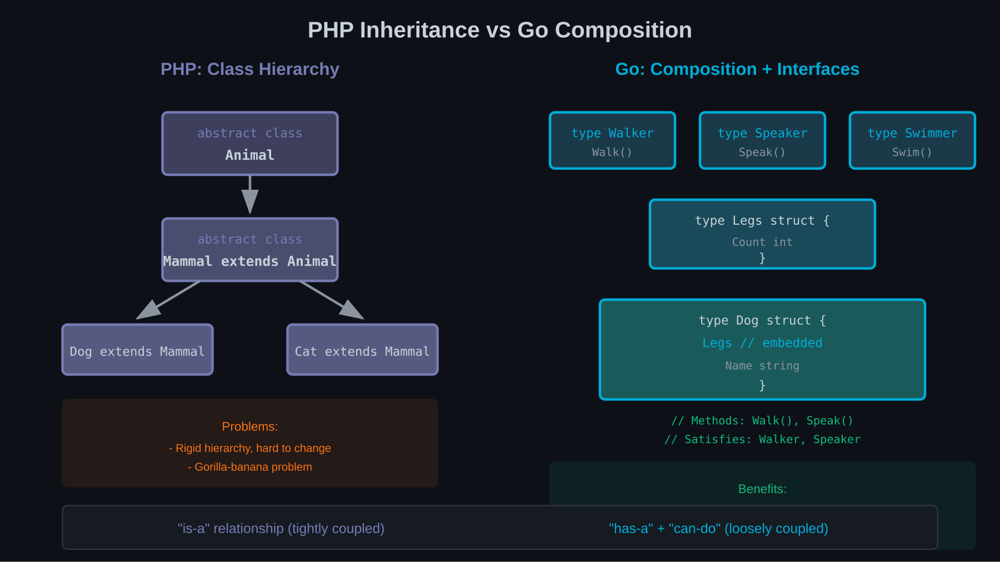

# Chapter 6: Inheritance Is Dead — Long Live Composition

If you've been using PHP for years, inheritance is deeply wired into your thinking. Base classes, abstract methods, parent::calls—these are fundamental tools in your mental toolkit.

Go has no inheritance. None. This isn't a limitation to work around; it's a deliberate design choice that leads to better code.



## Why Go Has No Inheritance

Inheritance creates several problems at scale:

### 1. The Fragile Base Class Problem

When you modify a base class, you might break subclasses in unexpected ways:

```php
abstract class PaymentProcessor
{
    public function process(Payment $payment): void
    {
        $this->validate($payment);  // Added in version 2
        $this->doProcess($payment);
    }

    protected function validate(Payment $payment): void
    {
        if ($payment->getAmount() <= 0) {
            throw new InvalidPaymentException();
        }
    }

    abstract protected function doProcess(Payment $payment): void;
}
```

Now every subclass's `doProcess` must handle pre-validated payments. If a subclass was doing its own validation, there's duplicate validation. If the base validation is too strict for some subclass, tough luck.

### 2. The Diamond Problem

PHP solves this with traits and explicit conflict resolution, but it's inherently complex:

```php
trait Loggable {
    public function log(string $msg): void { /* ... */ }
}

trait Auditable {
    public function log(string $msg): void { /* ... */ }  // Conflict!
}

class Service {
    use Loggable, Auditable {
        Loggable::log insteadof Auditable;
        Auditable::log as auditLog;
    }
}
```

### 3. Deep Hierarchies

Inheritance encourages deep hierarchies:

```
Entity
  └── TimestampedEntity
        └── SoftDeletableEntity
              └── User
                    └── AdminUser
```

Understanding `AdminUser` requires understanding four parent classes. Debugging means jumping between files. Changes ripple unpredictably.

### Go's Solution: Don't Provide It

Rather than solving inheritance problems, Go simply doesn't offer inheritance. Instead, it provides:

- **Composition**: Structs containing other structs
- **Embedding**: Composition with syntactic sugar
- **Interfaces**: Behavioural contracts without hierarchies

## Embedding: "Inheritance" Without Hierarchy

Go's embedding provides some inheritance-like behaviour:

```go
type Animal struct {
    Name string
}

func (a *Animal) Speak() string {
    return "..."
}

type Dog struct {
    Animal  // Embedded
    Breed   string
}

func (d *Dog) Speak() string {
    return "Woof!"
}

// Usage
dog := Dog{Animal: Animal{Name: "Rex"}, Breed: "German Shepherd"}
fmt.Println(dog.Name)     // Promoted from Animal
fmt.Println(dog.Speak())  // Dog's method, not Animal's
```

The embedded `Animal` fields and methods are "promoted" to `Dog`. You can access `dog.Name` instead of `dog.Animal.Name`.

### What Embedding Is Not

Embedding looks like inheritance but isn't:

```go
var animal *Animal = &dog  // Error! Dog is not an Animal
```

A `Dog` doesn't substitute for an `Animal`. There's no subtype relationship. Embedding is purely syntactic convenience for composition.

### Embedding vs Inheritance

| Inheritance | Embedding |
|-------------|-----------|
| `Dog IS-A Animal` | `Dog HAS-A Animal` |
| Subtype relationship | No type relationship |
| Virtual dispatch | Method promotion |
| Parent can reference child | Embedded doesn't know embedder |
| `protected` access | No special access |

## Interface Composition

Instead of inheriting behaviour, Go composes interfaces:

```go
type Reader interface {
    Read(p []byte) (n int, err error)
}

type Writer interface {
    Write(p []byte) (n int, err error)
}

type ReadWriter interface {
    Reader
    Writer
}
```

`ReadWriter` embeds `Reader` and `Writer`. Any type implementing both interfaces automatically implements `ReadWriter`.

This approach is more flexible than class inheritance:

```php
// PHP: Must explicitly declare interfaces
class FileHandler implements Reader, Writer { }
```

```go
// Go: Implements ReadWriter automatically if it has both methods
type FileHandler struct { /* ... */ }
func (f *FileHandler) Read(p []byte) (int, error) { /* ... */ }
func (f *FileHandler) Write(p []byte) (int, error) { /* ... */ }
// FileHandler implements Reader, Writer, AND ReadWriter
```

## The PHP Developer's Temptation to Fake Inheritance

Coming from PHP, you might try to recreate inheritance:

### Don't: Recreating Abstract Classes

```go
// Tempting but wrong
type BaseService struct {
    logger *slog.Logger
}

func (b *BaseService) Log(msg string) {
    b.logger.Info(msg)
}

type UserService struct {
    BaseService
    repo UserRepository
}

type OrderService struct {
    BaseService
    repo OrderRepository
}
```

This looks like inheritance but has problems:

1. `UserService` and `OrderService` don't share a type
2. Changes to `BaseService` affect both opaquely
3. It's fighting Go's design

### Do: Use Composition Explicitly

```go
type Logger interface {
    Info(msg string)
}

type UserService struct {
    logger Logger
    repo   UserRepository
}

func (s *UserService) CreateUser(u User) error {
    s.logger.Info("creating user")
    // ...
}

type OrderService struct {
    logger Logger
    repo   OrderRepository
}

func (s *OrderService) CreateOrder(o Order) error {
    s.logger.Info("creating order")
    // ...
}
```

Each service has a logger, explicitly. The relationship is clear. Testing is straightforward—inject mock loggers.

### Don't: Deep Embedding Chains

```go
// Tempting but problematic
type Entity struct {
    ID        uuid.UUID
    CreatedAt time.Time
}

type SoftDeletable struct {
    Entity
    DeletedAt *time.Time
}

type User struct {
    SoftDeletable
    Name  string
    Email string
}
```

This recreates PHP's deep hierarchies. Go encourages flat structures:

```go
type User struct {
    ID        uuid.UUID
    CreatedAt time.Time
    DeletedAt *time.Time  // nullable for soft delete
    Name      string
    Email     string
}
```

Is there code duplication if `Order` has the same fields? Yes, a little. But each type is independent, understandable, and modifiable without affecting others.

## Flattening Deep Hierarchies

When converting PHP code with deep inheritance, flatten aggressively.

### PHP: Deep Hierarchy

```php
abstract class Controller
{
    protected function render(string $template, array $data): Response;
    protected function json($data): JsonResponse;
    protected function redirect(string $url): RedirectResponse;
}

abstract class ApiController extends Controller
{
    protected function validate(Request $request, array $rules): array;
    protected function paginate(QueryBuilder $query): Paginator;
}

class UserApiController extends ApiController
{
    public function index(Request $request): JsonResponse
    {
        $validated = $this->validate($request, ['page' => 'integer']);
        $users = $this->paginate($this->userQuery);
        return $this->json($users);
    }
}
```

### Go: Flat Composition

```go
type UserHandler struct {
    repo       UserRepository
    validator  Validator
    paginator  Paginator
}

func (h *UserHandler) List(w http.ResponseWriter, r *http.Request) {
    params, err := h.validator.Validate(r, ListUsersRequest{})
    if err != nil {
        writeError(w, err)
        return
    }

    users, err := h.paginator.Paginate(h.repo.Query(), params.Page)
    if err != nil {
        writeError(w, err)
        return
    }

    writeJSON(w, users)
}

// Helper functions, not inherited methods
func writeJSON(w http.ResponseWriter, data any) {
    w.Header().Set("Content-Type", "application/json")
    json.NewEncoder(w).Encode(data)
}

func writeError(w http.ResponseWriter, err error) {
    // Error handling
}
```

The `UserHandler` doesn't inherit from anything. It composes the pieces it needs. Helper functions live in the package, not a base class.

## Doctrine Entities Without Inheritance

Doctrine encourages inheritance for common entity behaviour:

```php
/** @MappedSuperclass */
abstract class BaseEntity
{
    /** @Column(type="uuid") */
    protected UuidInterface $id;

    /** @Column(type="datetime_immutable") */
    protected DateTimeImmutable $createdAt;

    /** @Column(type="datetime_immutable", nullable=true) */
    protected ?DateTimeImmutable $updatedAt = null;
}

/** @Entity */
class User extends BaseEntity
{
    /** @Column */
    private string $name;
}
```

In Go, you typically define each type fully:

```go
type User struct {
    ID        uuid.UUID
    CreatedAt time.Time
    UpdatedAt *time.Time
    Name      string
}

type Order struct {
    ID        uuid.UUID
    CreatedAt time.Time
    UpdatedAt *time.Time
    UserID    uuid.UUID
    Total     decimal.Decimal
}
```

If you truly need shared fields, you can embed—but carefully:

```go
type Timestamps struct {
    CreatedAt time.Time
    UpdatedAt *time.Time
}

type User struct {
    ID uuid.UUID
    Timestamps
    Name string
}

// Accessing fields
user.CreatedAt     // Works via promotion
user.Timestamps.CreatedAt  // Also works
```

But consider: is the embedding adding value, or just reducing a few lines of duplication while adding abstraction?

## Summary

- **Go has no inheritance**—this is intentional, not a limitation
- **Embedding** provides method promotion but not subtyping
- **Interface composition** creates flexible behavioural contracts
- **Flat structures** are preferred over deep embedding chains
- **Fight the temptation** to recreate inheritance patterns

---

## Exercises

1. **Hierarchy Flattening**: Take a PHP class hierarchy with 3+ levels. Convert to Go with flat structs and composition. Compare the dependency graph before and after.

2. **Interface Extraction**: Find a PHP class that extends a base class. Identify what behaviour it inherits. Define Go interfaces for that behaviour instead.

3. **Embedding Evaluation**: Write a Go struct that embeds another struct. Then rewrite it without embedding, using explicit fields. Which is clearer?

4. **Trait Replacement**: Take PHP code using traits. Convert to Go using either embedding or composition. Which approach better matches Go idioms?

5. **Template Method Refactor**: Find a PHP class using the Template Method pattern (abstract base class with hook methods). Refactor to Go using interfaces and composition.

6. **Entity Duplication Analysis**: Write Go structs for 5 related entities (User, Order, Product, Review, Category). Note the duplicated fields. Decide whether embedding helps or hurts.

7. **Decorator Pattern**: Implement the decorator pattern in PHP using inheritance, then in Go using interface wrapping. Compare the flexibility and testability.

8. **Inheritance Smell Detection**: Review PHP code for these inheritance smells:
   - Deep hierarchies (>2 levels)
   - Base classes with many abstract methods
   - Subclasses that override most methods

   For each smell, design a Go alternative using composition.
