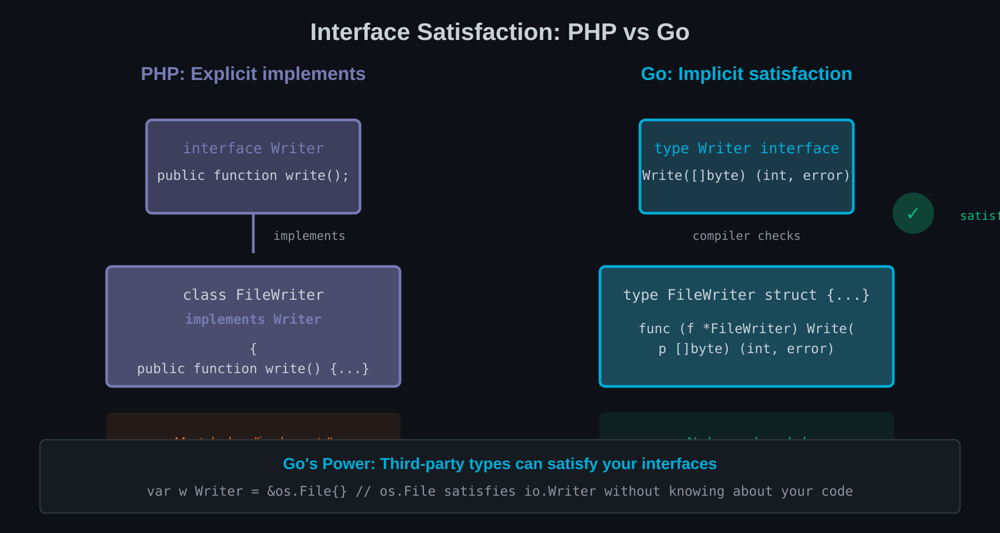

# Chapter 7: Interfaces — Go's Hidden Superpower

PHP interfaces are explicit contracts. You declare `implements`, and the class must provide all methods. Go interfaces work differently—and this difference is profound.



## Implicit Satisfaction (No `implements`)

In PHP, the relationship is declared:

```php
interface Logger
{
    public function info(string $message): void;
    public function error(string $message): void;
}

class FileLogger implements Logger
{
    public function info(string $message): void { /* ... */ }
    public function error(string $message): void { /* ... */ }
}
```

In Go, satisfaction is implicit:

```go
type Logger interface {
    Info(msg string)
    Error(msg string)
}

type FileLogger struct {
    file *os.File
}

func (l *FileLogger) Info(msg string) {
    fmt.Fprintln(l.file, "INFO:", msg)
}

func (l *FileLogger) Error(msg string) {
    fmt.Fprintln(l.file, "ERROR:", msg)
}

// FileLogger implements Logger automatically
// No declaration needed
```

`FileLogger` implements `Logger` because it has the required methods. No `implements` keyword. No explicit declaration. The compiler figures it out.

### Why Implicit Is Powerful

This enables decoupled design:

1. **You can define interfaces where they're used**, not where implementations live
2. **Third-party types can satisfy your interfaces** without modification
3. **Small interfaces are trivial to create** after the fact

```go
// In your package
type Storer interface {
    Store(key string, value []byte) error
}

// A third-party type might already satisfy this
// without knowing about your interface
type RedisClient struct { /* ... */ }
func (c *RedisClient) Store(key string, value []byte) error { /* ... */ }

// Your code works with RedisClient automatically
func SaveData(s Storer, key string, data []byte) error {
    return s.Store(key, data)
}
```

In PHP, you'd need `RedisClient` to declare `implements Storer`—which requires modifying third-party code or wrapping it.

## Small Interfaces: The `io.Reader` Philosophy

PHP interfaces often have many methods:

```php
interface RepositoryInterface
{
    public function find(int $id): ?Entity;
    public function findAll(): array;
    public function findBy(array $criteria): array;
    public function save(Entity $entity): void;
    public function delete(Entity $entity): void;
    public function count(): int;
}
```

Go favours tiny interfaces:

```go
// The famous io.Reader - just one method
type Reader interface {
    Read(p []byte) (n int, err error)
}

// io.Writer - just one method
type Writer interface {
    Write(p []byte) (n int, err error)
}

// io.Closer - just one method
type Closer interface {
    Close() error
}

// Compose them as needed
type ReadWriteCloser interface {
    Reader
    Writer
    Closer
}
```

### Why Small Interfaces Win

**More types satisfy them**: A one-method interface is easy to implement. Many existing types accidentally implement `io.Reader`.

**Better composition**: Combine small interfaces into exactly what you need:

```go
// A function that only needs reading
func Process(r io.Reader) error { /* ... */ }

// A function that needs reading and closing
func ProcessAndClose(r io.ReadCloser) error {
    defer r.Close()
    return Process(r)
}
```

**Easier testing**: Mock one method, not ten:

```go
type mockReader struct {
    data []byte
}

func (m *mockReader) Read(p []byte) (int, error) {
    copy(p, m.data)
    return len(m.data), io.EOF
}
```

### The Interface Segregation Principle by Default

PHP's SOLID principles include Interface Segregation: "Clients should not be forced to depend on methods they do not use."

Go makes this the natural state. When you create a one-method interface, clients only depend on that one method.

## Accept Interfaces, Return Structs

This Go proverb captures a key design pattern.

### Accept Interfaces

Functions should accept the minimal interface they need:

```go
// Good: accepts io.Reader
func ParseJSON(r io.Reader, v any) error {
    return json.NewDecoder(r).Decode(v)
}

// Can be called with:
ParseJSON(os.Stdin, &config)           // *os.File
ParseJSON(resp.Body, &data)            // http.Response.Body
ParseJSON(bytes.NewReader(b), &msg)    // *bytes.Reader
ParseJSON(strings.NewReader(s), &doc)  // *strings.Reader
```

### Return Structs

Functions should return concrete types:

```go
// Good: returns concrete *Server
func NewServer(config Config) *Server {
    return &Server{config: config}
}

// Not: returns interface
func NewServer(config Config) ServerInterface {
    return &Server{config: config}  // Unnecessary abstraction
}
```

Why? Returning interfaces:
- Hides what the caller actually gets
- Prevents access to type-specific methods
- Adds a layer of indirection without benefit

The caller can always store the result in an interface variable if they want:

```go
var s ServerInterface = NewServer(cfg)  // Caller's choice
```

### PHP Comparison

PHP often does the opposite:

```php
// Common PHP pattern
interface UserRepositoryInterface { /* ... */ }

class DoctrineUserRepository implements UserRepositoryInterface { /* ... */ }

// Returns interface
public function getUserRepository(): UserRepositoryInterface
{
    return $this->userRepository;
}
```

This is idiomatic PHP for dependency injection. In Go, you'd return the concrete type and accept interfaces where needed.

## The Empty Interface and When to Avoid It

Go's `any` (alias for `interface{}`) is like PHP's `mixed`:

```go
func PrintAnything(v any) {
    fmt.Println(v)
}

PrintAnything(42)
PrintAnything("hello")
PrintAnything(User{Name: "Alice"})
```

### Legitimate Uses

1. **Serialisation**: `json.Marshal(v any)`
2. **Logging**: `log.Printf("%v", value)`
3. **Generic containers** (pre-generics code)

### When to Avoid

Most uses of `any` indicate a design problem:

```go
// Bad: loses type safety
func Process(data any) any {
    // Now you need type switches everywhere
}

// Better: use generics
func Process[T any](data T) T {
    // T is still a type parameter, but preserved through the function
}

// Or: use specific interfaces
func Process(data Processable) Result {
    return data.Process()
}
```

### The `any` Smell Test

Ask yourself: "Why don't I know the type here?"

- **I'm writing a library for many types** → Consider generics
- **The type varies at runtime** → Define an interface for the common behaviour
- **I really don't care about the type** → `any` might be appropriate (logging, debugging)
- **I'm being lazy** → Define proper types

## Comparing to Symfony's Interface-Driven Design

Symfony uses interfaces extensively:

```php
interface EventDispatcherInterface
{
    public function dispatch(object $event): object;
    public function addListener(string $eventName, callable $listener): void;
    public function addSubscriber(EventSubscriberInterface $subscriber): void;
    public function removeListener(string $eventName, callable $listener): void;
    public function removeSubscriber(EventSubscriberInterface $subscriber): void;
    public function getListeners(?string $eventName = null): array;
    public function hasListeners(?string $eventName = null): bool;
}
```

This interface has seven methods. Any implementation must provide all of them, even if a consumer only needs `dispatch`.

### Go's Approach

In Go, you'd define interfaces at the point of use:

```go
// In a package that just dispatches events
type Dispatcher interface {
    Dispatch(ctx context.Context, event Event) error
}

// In a package that manages listeners
type ListenerManager interface {
    AddListener(eventName string, listener Listener)
    RemoveListener(eventName string, listener Listener)
}

// The full implementation satisfies both
type EventDispatcher struct { /* ... */ }
func (d *EventDispatcher) Dispatch(ctx context.Context, event Event) error { /* ... */ }
func (d *EventDispatcher) AddListener(eventName string, listener Listener) { /* ... */ }
func (d *EventDispatcher) RemoveListener(eventName string, listener Listener) { /* ... */ }
```

Each consumer depends only on what it needs. Testing is simpler. Dependencies are minimal.

### Interface Location

In PHP, interfaces live with (or near) their implementations.

In Go, interfaces live with their consumers:

```
// PHP structure
src/EventDispatcher/EventDispatcherInterface.php
src/EventDispatcher/EventDispatcher.php

// Go structure
eventdispatcher/dispatcher.go  // Implementation only

// Consumer defines its own interface
orderservice/service.go
    type Dispatcher interface {
        Dispatch(ctx context.Context, event Event) error
    }
```

This inverts the dependency—implementations don't know about consumers' interfaces.

## Summary

- **Implicit satisfaction** enables powerful decoupling
- **Small interfaces** (1-3 methods) are idiomatic Go
- **Accept interfaces, return structs** for flexible APIs
- **Avoid `any`** unless you genuinely don't care about the type
- **Define interfaces where used**, not where implemented

---

## Exercises

1. **Interface Extraction**: Take a PHP class with 5+ methods. Define the smallest Go interface(s) that different consumers would actually need.

2. **Third-Party Satisfaction**: Find a third-party Go package type. Define an interface in your code that it satisfies without modification. Use it in a function.

3. **Interface Composition**: Create three single-method interfaces. Compose them into two different combined interfaces. Write functions accepting each combination.

4. **Refactor Away `any`**: Find Go code using `any` or `interface{}`. Refactor to use specific types or generics. What type information was lost with `any`?

5. **Consumer-Defined Interfaces**: Take a Go package that returns concrete types. In a separate package, define interfaces for only the methods you need. Verify the types satisfy them.

6. **Mock Creation**: Write a one-method interface. Create a mock implementation for testing. Compare this to mocking a PHP interface with 10 methods.

7. **Interface Location Analysis**: In a PHP Symfony project, note where interfaces are defined (with implementations or separately). Redesign for Go's consumer-defined pattern.

8. **The `any` Audit**: Search a Go codebase for uses of `any` or `interface{}`. Categorise each use as legitimate or avoidable. Propose refactors for the avoidable ones.
