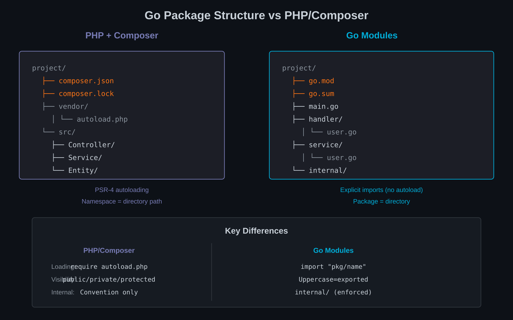

# Chapter 8: Packages and Modules

PHP's Composer revolutionised dependency management. Go's module system takes a different approach—simpler in some ways, stricter in others. Understanding these differences is key to structuring Go projects effectively.



## No Autoloading: Explicit Imports

PHP's autoloading is magical:

```php
// No require statements needed
use App\Service\UserService;
use App\Repository\UserRepository;
use Symfony\Component\Mailer\MailerInterface;

class SomeController
{
    public function __construct(
        private UserService $userService,  // Autoloaded
    ) {}
}
```

Composer's autoloader finds classes based on namespace conventions. You never write `require` statements.

Go requires explicit imports:

```go
package main

import (
    "context"
    "fmt"
    "log/slog"

    "github.com/yourorg/yourproject/internal/service"
    "github.com/yourorg/yourproject/internal/repository"
)

func main() {
    // Use imported packages
    repo := repository.NewUserRepository(db)
    svc := service.NewUserService(repo)
}
```

Every package you use must be imported. The compiler enforces this—unused imports are errors.

### Import Paths

Import paths are URLs (without the protocol):

```go
import (
    // Standard library
    "encoding/json"
    "net/http"

    // Third-party
    "github.com/gin-gonic/gin"
    "github.com/jmoiron/sqlx"

    // Your project
    "github.com/yourorg/yourproject/internal/config"
)
```

This explicitness has benefits:
- You can see all dependencies at a glance
- No magic resolution rules to remember
- Tooling can analyse imports statically

## `go.mod` vs `composer.json`

Both files declare project dependencies, but they work differently.

### Composer's Approach

```json
{
    "name": "myorg/myproject",
    "require": {
        "php": "^8.2",
        "symfony/framework-bundle": "^6.3",
        "doctrine/orm": "^2.15"
    },
    "require-dev": {
        "phpunit/phpunit": "^10.0"
    },
    "autoload": {
        "psr-4": {
            "App\\": "src/"
        }
    }
}
```

Composer:
- Supports semantic version constraints (`^6.3`, `~2.15`)
- Separates dev dependencies
- Configures autoloading
- Uses `composer.lock` for exact versions

### Go's Approach

```go
// go.mod
module github.com/yourorg/yourproject

go 1.21

require (
    github.com/gin-gonic/gin v1.9.1
    github.com/jmoiron/sqlx v1.3.5
)

require (
    // indirect dependencies listed here
    github.com/go-playground/validator/v10 v10.14.0 // indirect
)
```

Go modules:
- Use exact versions (no `^` or `~`)
- Don't separate dev dependencies (use build tags instead)
- No autoload configuration (Go has fixed conventions)
- Use `go.sum` for checksums

### Version Selection

Composer picks the highest version satisfying all constraints.

Go uses **Minimal Version Selection (MVS)**: it picks the minimum version that satisfies all requirements. This is more predictable—adding a dependency can't unexpectedly upgrade another.

## Internal Packages: Visibility Control

Go has a special `internal` directory that restricts imports:

```
myproject/
├── cmd/
│   └── server/
│       └── main.go
├── internal/           # Can only be imported by myproject
│   ├── config/
│   ├── repository/
│   └── service/
├── pkg/                # Can be imported by anyone (convention)
│   └── utils/
└── go.mod
```

Code in `internal/` can only be imported by packages within the same module (or parent directory). External projects cannot import your internal packages.

This enforces public API boundaries:

```go
// External project
import "github.com/yourorg/yourproject/internal/service"  // Error!
import "github.com/yourorg/yourproject/pkg/utils"         // OK
```

### PHP Comparison

PHP has no equivalent. Any class in `vendor/` can be used:

```php
// Using Symfony's internal classes (bad practice but possible)
use Symfony\Component\HttpKernel\Internal\SomeInternalClass;
```

The `@internal` annotation is advisory only—it doesn't prevent imports.

## No Circular Imports: Designing for DAGs

Go forbids circular imports:

```go
// package a
import "myproject/b"  // a imports b

// package b
import "myproject/a"  // b imports a — ERROR!
```

This seems restrictive but enforces good design. Dependencies must form a Directed Acyclic Graph (DAG).

### PHP's Circular Dependencies

PHP allows circular dependencies:

```php
// UserService.php
use App\Service\OrderService;

class UserService
{
    public function __construct(private OrderService $orders) {}
}

// OrderService.php
use App\Service\UserService;

class OrderService
{
    public function __construct(private UserService $users) {}
}
```

Symfony's container resolves this at runtime via lazy loading. But circular dependencies indicate design problems—the classes are too tightly coupled.

### Breaking Cycles in Go

When you hit a circular import, you must restructure:

**Option 1: Extract shared code to a third package**

```
Before:
a → b → a (cycle)

After:
a → common
b → common
```

**Option 2: Use interfaces to invert dependencies**

```go
// package user
type OrderFinder interface {
    FindByUser(userID string) ([]Order, error)
}

type Service struct {
    orders OrderFinder  // Interface, not concrete type
}

// package order
type Service struct { /* ... */ }

func (s *Service) FindByUser(userID string) ([]Order, error) { /* ... */ }
```

Now `user` depends on an interface it defines, not on the `order` package.

## Vendor vs Module Proxy

Composer downloads packages to `vendor/` and commits or ignores it.

Go has two modes:

### Module Proxy (Default)

Go downloads modules from a proxy (default: `proxy.golang.org`):

```bash
# Downloads to module cache
go mod download

# Module cache location
~/go/pkg/mod/
```

The proxy:
- Caches modules for availability
- Provides checksums for verification
- Speeds up downloads globally

### Vendoring (Optional)

You can vendor dependencies:

```bash
go mod vendor
```

This creates a `vendor/` directory like Composer. Use when:
- You need reproducible builds without network
- You want to audit or patch dependencies
- Your CI doesn't have proxy access

Most Go projects use the proxy, not vendoring.

## Migrating a Composer Mindset

Several mental shifts are needed:

### 1. One Package Per Directory

PHP: Multiple classes per file, namespaces independent of directories.

Go: One package per directory. All `.go` files in a directory are the same package:

```
repository/
├── user.go      // package repository
├── order.go     // package repository
└── product.go   // package repository
```

### 2. Package Names Are Short

PHP: `App\Repository\User\UserRepository`

Go: `repository.NewUserRepository()`

Package names are typically one word. The full path provides context:

```go
import "myproject/internal/repository"

repo := repository.NewUser(db)  // "repository.NewUser" is clear enough
```

### 3. No Private Packages

PHP: You can have `private` Composer packages.

Go: All modules are public by default. Private modules require:
- GOPRIVATE environment variable
- Git authentication configuration
- Private proxy (Athens, Artifactory)

### 4. No Package Versions in Import Paths (Usually)

PHP: Namespace is independent of version.

Go: Major versions 2+ must be in the import path:

```go
import "github.com/example/lib/v2"  // Major version 2
import "github.com/example/lib/v3"  // Major version 3
```

This allows using multiple major versions simultaneously.

## Flex Recipes vs Go's Simplicity

Symfony Flex provides recipes that configure packages automatically:

```bash
composer require symfony/mailer
# Flex: Creates config/packages/mailer.yaml
# Flex: Adds MAILER_DSN to .env
# Flex: Registers bundles
```

Go has no equivalent. Adding a package means:

1. `go get github.com/example/package`
2. Write code that uses it
3. That's it

No automatic configuration, no generated files, no magic wiring.

This simplicity means:
- Less to learn
- Fewer surprises
- More explicit code
- More manual setup

## Summary

- **Explicit imports** replace autoloading
- **`go.mod`** uses exact versions and minimal version selection
- **`internal/`** enforces API boundaries
- **No circular imports** forces DAG dependency structures
- **Module proxy** replaces `vendor/` by default
- **Simpler packaging** means more explicit code

---

## Exercises

1. **Import Analysis**: Run `go mod graph` on a Go project and `composer show -t` on a PHP project. Compare the dependency tree structures.

2. **Circular Dependency Break**: Create a Go project with two packages that should be circular. Use interfaces to break the cycle without merging them.

3. **Internal Package Design**: Design a Go project structure with clear public API (`pkg/`) and private implementation (`internal/`). What goes where?

4. **Version Selection Comparison**: In a PHP project, add a dependency that requires an older version of an existing dependency. How does Composer resolve it? Then try similar in Go.

5. **Package Naming**: Take a PHP project's namespace structure. Propose a Go package structure with idiomatic short names.

6. **Vendor vs Proxy**: Set up a Go project with vendoring. Then remove `vendor/` and use the proxy. Compare workflow and reproducibility.

7. **Recipe Replacement**: Take a Symfony Flex recipe (e.g., for mailer). List all automatic changes it makes. Write equivalent manual Go setup.

8. **DAG Verification**: Draw the package dependency graph for a Go project. Verify it's a DAG. Then draw one for a PHP project—is it also a DAG?
