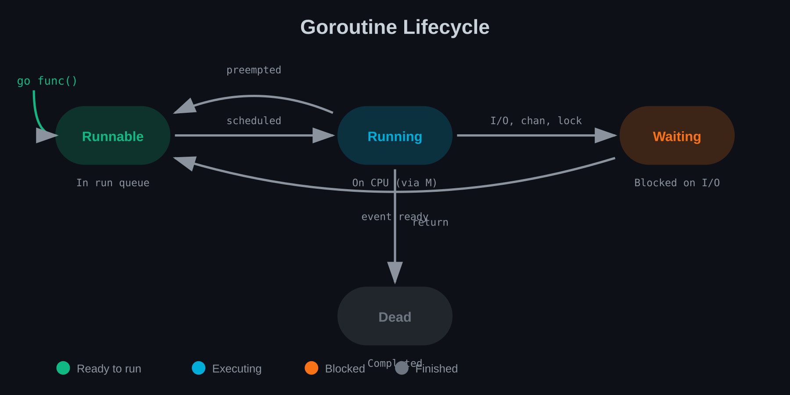
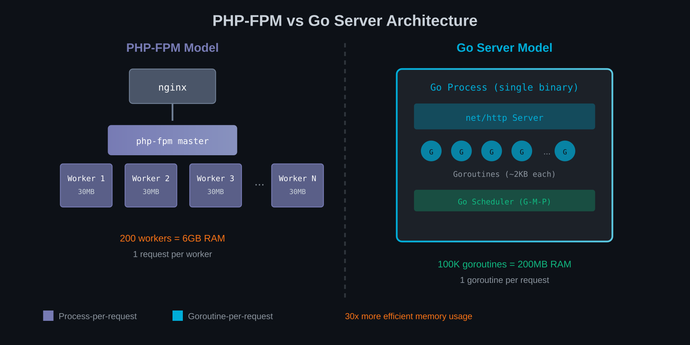

# Chapter 15: Introducing Concurrency

This is where your PHP mental model needs the biggest rewrite. PHP is fundamentally single-threaded. Each request gets one thread of execution, start to finish. Go can run thousands of concurrent operations in a single process.

## What PHP Doesn't Have (And Why)

PHP's execution model:

```
Request arrives → PHP-FPM worker handles it → Response sent → Worker freed
```

Each worker processes one request at a time. Concurrency in PHP happens at the process level—multiple workers handling multiple requests simultaneously.

Within a single request, everything is sequential:

```php
// Sequential execution - no concurrency
$user = $this->userService->find($id);      // Wait
$orders = $this->orderService->findByUser($user);  // Wait
$recommendations = $this->recService->forUser($user);  // Wait
// Total time: sum of all three operations
```

### Why PHP Avoided Concurrency

1. **Simplicity**: Sequential code is easier to reason about
2. **Shared-nothing**: Each request is isolated
3. **Stateless design**: No shared state means no race conditions
4. **Historical context**: PHP was designed for simple web scripts

This model works—most of the web runs on it. But you can't:
- Fetch multiple API endpoints simultaneously within a request
- Process background jobs without separate workers
- Handle WebSocket connections efficiently
- Build high-performance real-time systems

### PHP's Concurrency Workarounds

PHP has evolved:
- **ReactPHP/Swoole**: Event-loop extensions
- **Symfony Messenger**: Async message processing
- **Parallel extension**: True threading
- **Fibers (PHP 8.1)**: Cooperative multitasking

But these are add-ons, not the core model. Go was designed for concurrency from the start.

## Goroutines vs Threads vs Processes

PHP concurrency uses processes:

```
php-fpm master
├── worker 1 (handles request A)
├── worker 2 (handles request B)
├── worker 3 (handles request C)
└── ... (50-200 workers typical)
```

Each worker is an OS process with its own memory. Safe but heavy—each process might use 20-50MB.

Traditional threading (Java, C++):

```
Process
├── Thread 1 (shared memory)
├── Thread 2 (shared memory)
└── Thread 3 (shared memory)
```

Threads share memory. Lighter than processes (~1MB stack each) but require careful synchronisation.

Go uses goroutines:

```
Go process
├── goroutine 1 (~2KB initially)
├── goroutine 2 (~2KB initially)
├── goroutine 1000 (~2KB initially)
└── ... (millions possible)
```

Goroutines are extremely lightweight—thousands or millions in a single process.

### Creating Goroutines

```go
// Sequential
result1 := fetchUserData(id)
result2 := fetchOrderHistory(id)

// Concurrent
go fetchUserData(id)     // Starts immediately, doesn't block
go fetchOrderHistory(id)  // Starts immediately, doesn't block
// Both run concurrently
```

The `go` keyword starts a goroutine. The function runs concurrently with the caller.

### Goroutine Lifecycle



### Waiting for Goroutines

```go
var wg sync.WaitGroup

wg.Add(2)  // We'll wait for 2 goroutines

go func() {
    defer wg.Done()
    fetchUserData(id)
}()

go func() {
    defer wg.Done()
    fetchOrderHistory(id)
}()

wg.Wait()  // Block until both complete
```

## The Go Scheduler Overview

Go has its own scheduler that maps goroutines to OS threads.

### The G-M-P Model

- **G (Goroutine)**: The unit of work
- **M (Machine)**: OS thread
- **P (Processor)**: Scheduler context (number = GOMAXPROCS)

```
P1          P2          P3          P4
│           │           │           │
├── G1      ├── G4      ├── G7      ├── G10
├── G2      ├── G5      ├── G8      └── G11
└── G3      └── G6      └── G9

Running on:
M1          M2          M3          M4
```

The scheduler:
- Multiplexes millions of goroutines onto few OS threads
- Handles blocking operations by parking goroutines
- Distributes work across available CPU cores
- Enables preemption to prevent starvation

### Why This Matters

You don't manage threads. You just write:

```go
for i := 0; i < 100000; i++ {
    go processItem(items[i])
}
```

The scheduler handles:
- Which goroutines run when
- How many OS threads to use
- Load balancing across cores
- Context switching

## Why PHP-FPM's Model Is Fundamentally Different



PHP-FPM scales by adding workers:

```
Load increases → Add more workers → Each handles one request
```

Go scales by adding goroutines:

```
Load increases → Add more goroutines → All share the same process
```

### Memory Efficiency

PHP (200 workers at 30MB each):
```
200 workers × 30MB = 6GB memory for 200 concurrent requests
```

Go (200,000 goroutines at 8KB each):
```
200,000 goroutines × 8KB = 1.6GB memory for 200,000 concurrent operations
```

### Connection Handling

PHP-FPM: One worker = one connection.

Go: One goroutine per connection, thousands of connections per process:

```go
func main() {
    listener, _ := net.Listen("tcp", ":8080")

    for {
        conn, _ := listener.Accept()
        go handleConnection(conn)  // New goroutine per connection
    }
}

func handleConnection(conn net.Conn) {
    defer conn.Close()
    // Handle this connection
    // Thousands can run concurrently
}
```

This is why Go excels at WebSockets, real-time APIs, and connection-heavy workloads.

## Mental Model: Thousands of Lightweight Threads

Think of goroutines as:
- **Cheap**: Start millions without concern
- **Independent**: Each has its own stack
- **Cooperative**: They yield at certain points
- **Scheduled**: Go manages their execution

### PHP Mental Model

```
Request → Execute code sequentially → Response
(One path through the code)
```

### Go Mental Model

```
Request → Spawn goroutines → Coordinate results → Response
(Multiple paths executing simultaneously)
```

### Example: Parallel API Calls

PHP (sequential):
```php
$user = $this->httpClient->get('/api/user/1');        // 100ms
$orders = $this->httpClient->get('/api/orders/1');    // 150ms
$reviews = $this->httpClient->get('/api/reviews/1');  // 80ms
// Total: 330ms
```

Go (concurrent):
```go
var (
    user    User
    orders  []Order
    reviews []Review
    wg      sync.WaitGroup
)

wg.Add(3)

go func() {
    defer wg.Done()
    user, _ = fetchUser(ctx, 1)  // 100ms
}()

go func() {
    defer wg.Done()
    orders, _ = fetchOrders(ctx, 1)  // 150ms
}()

go func() {
    defer wg.Done()
    reviews, _ = fetchReviews(ctx, 1)  // 80ms
}()

wg.Wait()
// Total: ~150ms (slowest operation)
```

The concurrent version is limited by the slowest operation, not the sum.

## Summary

- **PHP is single-threaded** per request; concurrency is at the process level
- **Goroutines are extremely lightweight**—start thousands without concern
- **The Go scheduler** manages goroutine-to-thread mapping automatically
- **PHP-FPM's model** scales with processes; Go scales with goroutines
- **Concurrent code** can dramatically reduce response times

---

## Exercises

1. **Goroutine Creation**: Write a program that starts 1,000 goroutines, each printing its index. Observe they don't print in order.

2. **WaitGroup Usage**: Fetch data from 5 URLs concurrently using goroutines and `sync.WaitGroup`. Time it versus sequential fetches.

3. **Memory Comparison**: Write a program that creates 100,000 goroutines and check memory usage. Compare to theoretical PHP worker memory.

4. **Scheduler Observation**: Use `runtime.GOMAXPROCS()` to limit to 1 CPU. Run concurrent work and observe scheduling behaviour.

5. **Request Aggregation**: Implement an HTTP handler that aggregates data from 3 internal APIs concurrently before responding.

6. **Goroutine Leak Detection**: Create a program with an intentional goroutine leak. Use `runtime.NumGoroutine()` to detect it.

7. **PHP Comparison**: Take a PHP script that makes sequential API calls. Estimate the speedup if rewritten with Go concurrency.

8. **Mental Model Documentation**: Write a document explaining Go concurrency to a PHP developer. Include diagrams of goroutines vs PHP workers.
