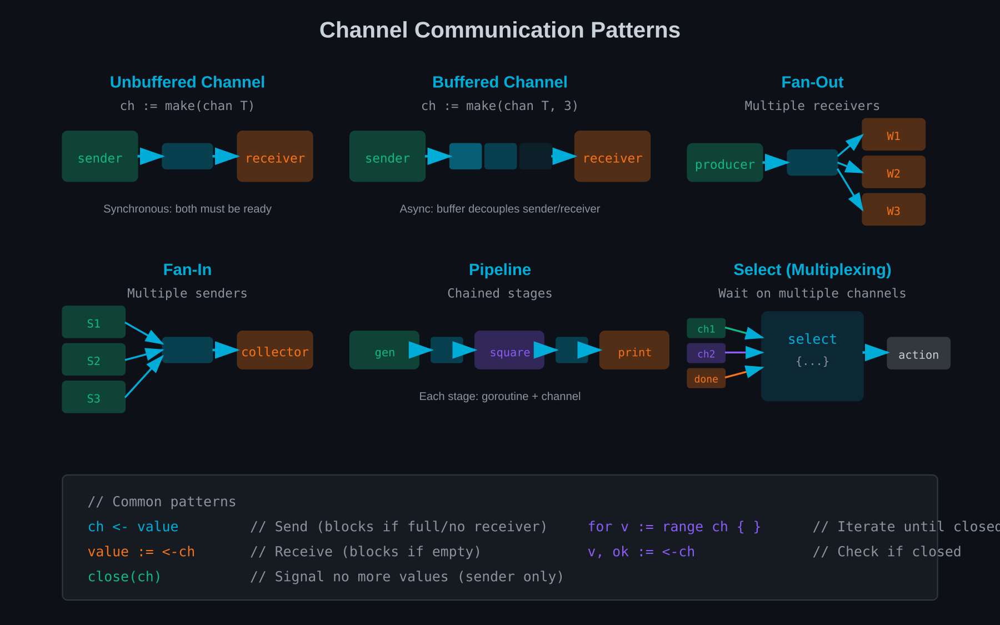

# Chapter 16: Channels — Message Passing

Goroutines run concurrently, but how do they communicate? Go's answer is channels—typed conduits for passing data between goroutines.



## Channels: Typed Message Passing

The philosophy: "Don't communicate by sharing memory; share memory by communicating."

PHP (if it had concurrency) might share state:

```php
// Hypothetical PHP threading (don't do this)
$results = [];
$mutex = new Mutex();

parallel([
    fn() => { $mutex->lock(); $results[] = fetch1(); $mutex->unlock(); },
    fn() => { $mutex->lock(); $results[] = fetch2(); $mutex->unlock(); },
]);
```

Go uses channels:

```go
results := make(chan string, 2)  // Channel of strings

go func() {
    results <- fetch1()  // Send to channel
}()

go func() {
    results <- fetch2()  // Send to channel
}()

r1 := <-results  // Receive from channel
r2 := <-results  // Receive from channel
```

### Creating Channels

```go
// Unbuffered channel (blocks until receiver ready)
ch := make(chan int)

// Buffered channel (can hold 10 items before blocking)
ch := make(chan int, 10)

// Channel of structs
ch := make(chan User)

// Channel of channels (yes, this is valid)
ch := make(chan chan int)
```

### Basic Operations

```go
ch := make(chan string)

// Send (blocks until someone receives)
ch <- "hello"

// Receive (blocks until something sent)
msg := <-ch

// Receive and discard
<-ch
```

## Buffered vs Unbuffered

### Unbuffered Channels

```go
ch := make(chan int)  // Unbuffered

go func() {
    ch <- 42  // Blocks until someone receives
}()

val := <-ch  // Receives 42
```

Unbuffered channels synchronise goroutines—the sender blocks until the receiver is ready.

### Buffered Channels

```go
ch := make(chan int, 3)  // Buffer size 3

ch <- 1  // Doesn't block (buffer has space)
ch <- 2  // Doesn't block
ch <- 3  // Doesn't block
ch <- 4  // BLOCKS until someone receives

val := <-ch  // Receives 1, makes room for next send
```

Buffered channels decouple sender and receiver:
- Sender blocks only when buffer is full
- Receiver blocks only when buffer is empty

### When to Use Which

**Unbuffered** (default):
- Synchronisation points
- Guaranteed handoff
- Simple request-response

**Buffered**:
- Asynchronous communication
- Rate smoothing
- Known batch sizes

## Channel Directions (Send-Only, Receive-Only)

Function signatures can restrict channel direction:

```go
// Send-only channel
func producer(out chan<- int) {
    out <- 42
    // <-out  // Error: cannot receive from send-only channel
}

// Receive-only channel
func consumer(in <-chan int) {
    val := <-in
    // in <- 1  // Error: cannot send to receive-only channel
}

// Bidirectional in main, restricted in functions
func main() {
    ch := make(chan int)

    go producer(ch)  // ch becomes send-only inside producer
    go consumer(ch)  // ch becomes receive-only inside consumer
}
```

This provides compile-time safety—functions can't misuse channels.

## Closing Channels

The sender signals completion by closing:

```go
ch := make(chan int)

go func() {
    for i := 0; i < 5; i++ {
        ch <- i
    }
    close(ch)  // Signal no more values
}()

// Receivers detect closure
for val := range ch {
    fmt.Println(val)  // Prints 0, 1, 2, 3, 4
}
// Loop exits when channel closed
```

### Detecting Closure

```go
val, ok := <-ch
if !ok {
    // Channel is closed
}
```

### Closing Rules

- Only senders should close channels
- Closing a closed channel panics
- Sending on a closed channel panics
- Receiving from a closed channel returns zero value and `false`

## Range Over Channels

The `range` keyword iterates until channel closes:

```go
func producer(ch chan<- int) {
    for i := 0; i < 10; i++ {
        ch <- i
    }
    close(ch)
}

func main() {
    ch := make(chan int)
    go producer(ch)

    for val := range ch {
        fmt.Println(val)
    }
    // Exits after channel closes
}
```

This is idiomatic for producer-consumer patterns.

## Practical Example: Parallel Processing

```go
func processItems(items []Item) []Result {
    results := make(chan Result, len(items))

    // Start workers
    for _, item := range items {
        item := item  // Capture for goroutine
        go func() {
            results <- process(item)
        }()
    }

    // Collect results
    output := make([]Result, 0, len(items))
    for range items {
        output = append(output, <-results)
    }

    return output
}
```

### With Error Handling

```go
type result struct {
    value Result
    err   error
}

func processItems(ctx context.Context, items []Item) ([]Result, error) {
    results := make(chan result, len(items))

    for _, item := range items {
        item := item
        go func() {
            val, err := process(ctx, item)
            results <- result{val, err}
        }()
    }

    output := make([]Result, 0, len(items))
    for range items {
        r := <-results
        if r.err != nil {
            return nil, r.err  // Fail fast
        }
        output = append(output, r.value)
    }

    return output, nil
}
```

## Common Patterns

### Generator Pattern

```go
func generateNumbers(max int) <-chan int {
    ch := make(chan int)
    go func() {
        defer close(ch)
        for i := 0; i < max; i++ {
            ch <- i
        }
    }()
    return ch
}

// Usage
for num := range generateNumbers(100) {
    fmt.Println(num)
}
```

### Request-Response

```go
type Request struct {
    Query    string
    Response chan<- Result  // Channel to send response
}

func server(requests <-chan Request) {
    for req := range requests {
        result := processQuery(req.Query)
        req.Response <- result
    }
}

// Client
func query(requests chan<- Request, q string) Result {
    response := make(chan Result)
    requests <- Request{Query: q, Response: response}
    return <-response
}
```

### Done Channel

```go
func worker(done <-chan struct{}, work <-chan Job) {
    for {
        select {
        case <-done:
            return  // Stop when done is closed
        case job := <-work:
            process(job)
        }
    }
}

// Usage
done := make(chan struct{})
// ... start workers ...
close(done)  // Signal all workers to stop
```

## Summary

- **Channels** are typed conduits for goroutine communication
- **Unbuffered channels** synchronise sender and receiver
- **Buffered channels** allow asynchronous communication
- **Channel directions** provide compile-time safety
- **Closing channels** signals no more values
- **Range over channels** iterates until closure

---

## Exercises

1. **Basic Channel**: Create a goroutine that sends 10 numbers on a channel. Receive and print them in main.

2. **Buffered Channel**: Implement a simple job queue with a buffered channel of size 5. Observe blocking behaviour.

3. **Direction Restrictions**: Write producer and consumer functions with appropriate channel direction restrictions.

4. **Generator**: Implement a Fibonacci generator that returns a receive-only channel.

5. **Request-Response**: Implement a calculator server that receives operations via channel and returns results.

6. **Parallel Map**: Write a function that applies a transformation to slice elements in parallel using channels.

7. **Fan-Out**: Send work to multiple worker goroutines via a shared channel.

8. **Done Pattern**: Implement graceful shutdown using a done channel to signal workers to stop.
