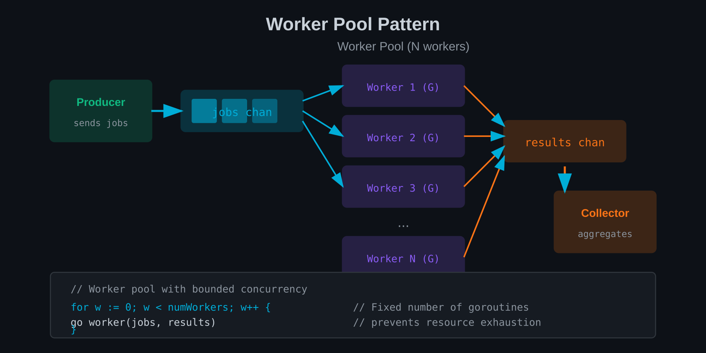

# Chapter 18: Concurrency Patterns

Armed with goroutines, channels, select, and context, you can implement powerful concurrency patterns. These patterns solve common problems elegantly.



## Worker Pools

Process items in parallel with a fixed number of workers:

```go
func workerPool(ctx context.Context, jobs <-chan Job, results chan<- Result, numWorkers int) {
    var wg sync.WaitGroup

    for i := 0; i < numWorkers; i++ {
        wg.Add(1)
        go func(workerID int) {
            defer wg.Done()
            for {
                select {
                case <-ctx.Done():
                    return
                case job, ok := <-jobs:
                    if !ok {
                        return  // Jobs channel closed
                    }
                    results <- processJob(job)
                }
            }
        }(i)
    }

    wg.Wait()
    close(results)
}

// Usage
func processAll(items []Item) []Result {
    jobs := make(chan Job, len(items))
    results := make(chan Result, len(items))

    ctx, cancel := context.WithCancel(context.Background())
    defer cancel()

    // Start worker pool
    go workerPool(ctx, jobs, results, 10)

    // Send jobs
    for _, item := range items {
        jobs <- Job{Item: item}
    }
    close(jobs)

    // Collect results
    var output []Result
    for result := range results {
        output = append(output, result)
    }
    return output
}
```

### Bounded Worker Pool

Limit concurrent work to prevent resource exhaustion:

```go
type Pool struct {
    sem     chan struct{}
    wg      sync.WaitGroup
}

func NewPool(maxWorkers int) *Pool {
    return &Pool{
        sem: make(chan struct{}, maxWorkers),
    }
}

func (p *Pool) Submit(task func()) {
    p.wg.Add(1)
    go func() {
        p.sem <- struct{}{}  // Acquire semaphore
        defer func() {
            <-p.sem  // Release semaphore
            p.wg.Done()
        }()
        task()
    }()
}

func (p *Pool) Wait() {
    p.wg.Wait()
}
```

## Fan-Out/Fan-In

**Fan-out**: Distribute work across multiple goroutines.
**Fan-in**: Combine results from multiple goroutines.

```go
func fanOut(input <-chan int, numWorkers int) []<-chan int {
    outputs := make([]<-chan int, numWorkers)

    for i := 0; i < numWorkers; i++ {
        outputs[i] = worker(input)
    }

    return outputs
}

func worker(input <-chan int) <-chan int {
    output := make(chan int)
    go func() {
        defer close(output)
        for n := range input {
            output <- process(n)
        }
    }()
    return output
}

func fanIn(inputs ...<-chan int) <-chan int {
    output := make(chan int)
    var wg sync.WaitGroup

    for _, in := range inputs {
        wg.Add(1)
        in := in
        go func() {
            defer wg.Done()
            for n := range in {
                output <- n
            }
        }()
    }

    go func() {
        wg.Wait()
        close(output)
    }()

    return output
}

// Usage
func processNumbers(numbers []int) []int {
    input := make(chan int)
    go func() {
        defer close(input)
        for _, n := range numbers {
            input <- n
        }
    }()

    // Fan out to 5 workers
    workers := fanOut(input, 5)

    // Fan in results
    results := fanIn(workers...)

    var output []int
    for result := range results {
        output = append(output, result)
    }
    return output
}
```

## Pipeline Processing

Connect stages of processing:

```go
func generator(nums ...int) <-chan int {
    out := make(chan int)
    go func() {
        defer close(out)
        for _, n := range nums {
            out <- n
        }
    }()
    return out
}

func square(in <-chan int) <-chan int {
    out := make(chan int)
    go func() {
        defer close(out)
        for n := range in {
            out <- n * n
        }
    }()
    return out
}

func filter(in <-chan int, predicate func(int) bool) <-chan int {
    out := make(chan int)
    go func() {
        defer close(out)
        for n := range in {
            if predicate(n) {
                out <- n
            }
        }
    }()
    return out
}

// Pipeline: generate → square → filter even
func main() {
    numbers := generator(1, 2, 3, 4, 5, 6, 7, 8, 9, 10)
    squared := square(numbers)
    even := filter(squared, func(n int) bool { return n%2 == 0 })

    for n := range even {
        fmt.Println(n)  // 4, 16, 36, 64, 100
    }
}
```

### Pipeline with Context

```go
func pipelineWithCancel(ctx context.Context, nums ...int) <-chan int {
    out := make(chan int)
    go func() {
        defer close(out)
        for _, n := range nums {
            select {
            case <-ctx.Done():
                return
            case out <- n:
            }
        }
    }()
    return out
}
```

## Semaphores

Limit concurrent access to a resource:

```go
type Semaphore chan struct{}

func NewSemaphore(n int) Semaphore {
    return make(chan struct{}, n)
}

func (s Semaphore) Acquire() {
    s <- struct{}{}
}

func (s Semaphore) Release() {
    <-s
}

// Usage: limit concurrent HTTP requests
func fetchAll(urls []string) {
    sem := NewSemaphore(10)  // Max 10 concurrent
    var wg sync.WaitGroup

    for _, url := range urls {
        wg.Add(1)
        url := url
        go func() {
            defer wg.Done()
            sem.Acquire()
            defer sem.Release()
            fetch(url)
        }()
    }

    wg.Wait()
}
```

## Rate Limiting

Control the rate of operations:

```go
// Simple rate limiter
func rateLimiter(rate time.Duration) <-chan time.Time {
    return time.Tick(rate)
}

func processWithRateLimit(items []Item) {
    limiter := rateLimiter(100 * time.Millisecond)  // 10 per second

    for _, item := range items {
        <-limiter  // Wait for tick
        go process(item)
    }
}
```

### Token Bucket Rate Limiter

```go
import "golang.org/x/time/rate"

func main() {
    // 10 requests per second, burst of 5
    limiter := rate.NewLimiter(10, 5)

    for i := 0; i < 100; i++ {
        if err := limiter.Wait(context.Background()); err != nil {
            log.Fatal(err)
        }
        go handleRequest(i)
    }
}
```

## Graceful Shutdown

Stop accepting new work, complete in-flight work, then exit:

```go
func main() {
    // Create server
    server := &http.Server{Addr: ":8080"}

    // Start server in goroutine
    go func() {
        if err := server.ListenAndServe(); err != http.ErrServerClosed {
            log.Fatal(err)
        }
    }()

    // Wait for interrupt signal
    quit := make(chan os.Signal, 1)
    signal.Notify(quit, syscall.SIGINT, syscall.SIGTERM)
    <-quit

    log.Println("Shutting down...")

    // Give outstanding requests 30 seconds to complete
    ctx, cancel := context.WithTimeout(context.Background(), 30*time.Second)
    defer cancel()

    if err := server.Shutdown(ctx); err != nil {
        log.Fatal("Forced shutdown:", err)
    }

    log.Println("Server stopped")
}
```

### Worker Pool Graceful Shutdown

```go
type WorkerPool struct {
    jobs     chan Job
    quit     chan struct{}
    wg       sync.WaitGroup
}

func (p *WorkerPool) Start(numWorkers int) {
    for i := 0; i < numWorkers; i++ {
        p.wg.Add(1)
        go p.worker()
    }
}

func (p *WorkerPool) worker() {
    defer p.wg.Done()
    for {
        select {
        case <-p.quit:
            return
        case job, ok := <-p.jobs:
            if !ok {
                return
            }
            process(job)
        }
    }
}

func (p *WorkerPool) Stop() {
    close(p.quit)  // Signal workers to stop
    p.wg.Wait()    // Wait for workers to finish
}

func (p *WorkerPool) StopAcceptingAndDrain() {
    close(p.jobs)  // Stop accepting new jobs
    p.wg.Wait()    // Wait for in-flight jobs
}
```

## Summary

- **Worker pools** limit concurrent workers to N
- **Fan-out/fan-in** distributes and collects work
- **Pipelines** chain processing stages
- **Semaphores** limit concurrent resource access
- **Rate limiting** controls operation frequency
- **Graceful shutdown** completes work before exit

---

## Exercises

1. **Worker Pool Implementation**: Build a worker pool that processes 1000 items with 10 workers. Measure speedup versus sequential.

2. **Fan-Out/Fan-In**: Implement image processing that fans out to resize images concurrently, then fans in results.

3. **Pipeline Design**: Create a data processing pipeline with 4 stages. Add context cancellation to all stages.

4. **Semaphore for API**: Use a semaphore to limit concurrent API requests to 5. Verify rate limiting works.

5. **Token Bucket**: Implement a token bucket rate limiter from scratch. Test with burst traffic.

6. **Graceful HTTP Server**: Build an HTTP server with graceful shutdown. Verify long requests complete during shutdown.

7. **Combined Patterns**: Build a system that uses worker pool + rate limiting + graceful shutdown together.

8. **Pipeline Metrics**: Add metrics to a pipeline (items processed, time per stage, errors). Make them accessible via HTTP.
